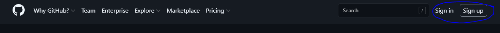
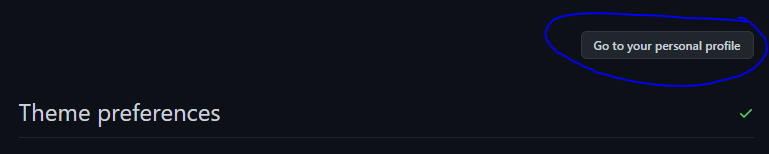

# Learning Security 📖

> This is a guide that will teach you the basics of:

- [Github/git](https://github.com/) - Storage
- [Visual Studio Code](https://code.visualstudio.com/) - Code Editor
- [Kali linux](https://www.kali.org/) - Toolbox
- [Juiceshop](https://owasp.org/www-project-juice-shop/) - Objective

> Please feel free to use this to get started in the wonderful world of security!

## Objective ✔️

This is intended for people who don't quite know where or how to start learning about security. I found 
that this is one of the hardest steps, and while there are a lot of tools available they all assume that you
have some working knowledge in the first place.

I graduated with a B.S. in Biochemistry so I can understand how all of this would be overwhelming to someone who
doesn't have a Computer Science or Information Technology background.

This is why I created this project. To help you when the spirit is willing but the mind is overwhelmed by all the 
information out there.

## Usage 🛠️

Follow along with this guide and by the end you will have a Kali security workstation that you can play around in 
and a Juiceshop container that you will be hacking.

### Start - Github Account

First off lets get you a github account, this is super useful as you can find anything from the project you are reading
to cutting edge opensource projects. Using github this way is neat and all but you would be leaving a lot of the full 
potential on the table, the real power comes in the form of developing on either your own or other peoples projects. 
[Click here to read more](https://github.com/open-source)

The purpose of this step of the guide will be to get you an account for later.

> Click "Sign up" or "Sign" in that should be present at the top right of the window:

> Once on the sign up page just follow the directions until you have your account.

> If your eyes are bleeding from the default light mode then click the button next to the + at the top right,
> then click settings in said drop down, followed by appearance, and then finally "Default dark".

> Click "Go to your personal profile" to go back to your profile page.

> Welcome to github!

> There is a lot to explore and do with github that will not be covered here but further tutorials are [here](https://guides.github.com/)!

### Code Editor - Visual Studio Code

For this we will be setting up [Visual Studio Code](https://code.visualstudio.com/) as your code editor. It has some
very helpful extensions and tools that will make your life easier.

> Of course to start you are going to download it [here](https://code.visualstudio.com/).

:TODO: ADD SETTING UP VS CODE

:TODO: ADD A COUPLE OF LINKS TO "LEARNING WINDOWS COMMANDS"

### Toolbox - Kali Linux

:TODO: ADD DOWNLOADING THE VAGRANTFILE AND RUNNING THE KALI SANDBOX UP COMMAND

:TODO: ADD A COUPLE OF USEFUL KALI APPS AND A COUPLE OF LINKS TO "LEARNING LINUX COMMANDS"

### Objective - Juiceshop

:TODO: ADD RUNNING THE JUICESHOP UP COMMAND AND HOW TO GET KALI AND JUICESHOP TO WORK TOGETHER